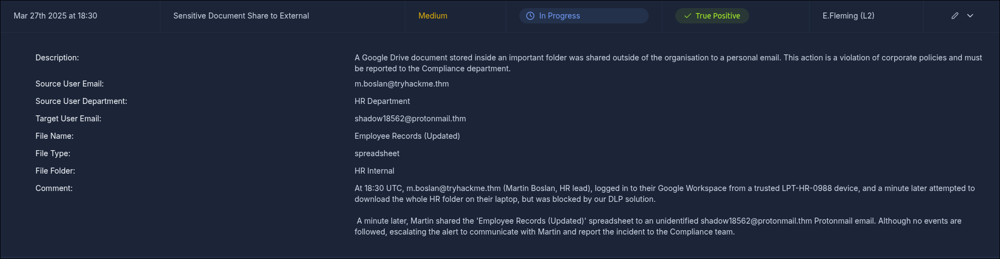
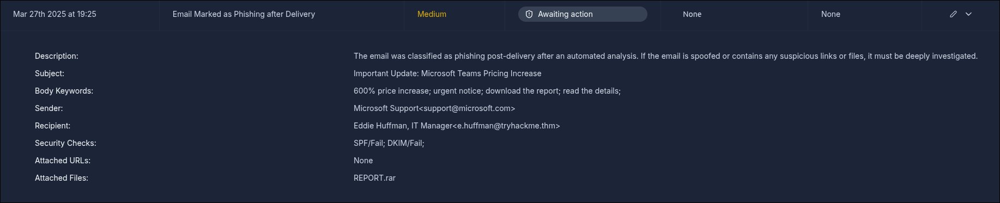
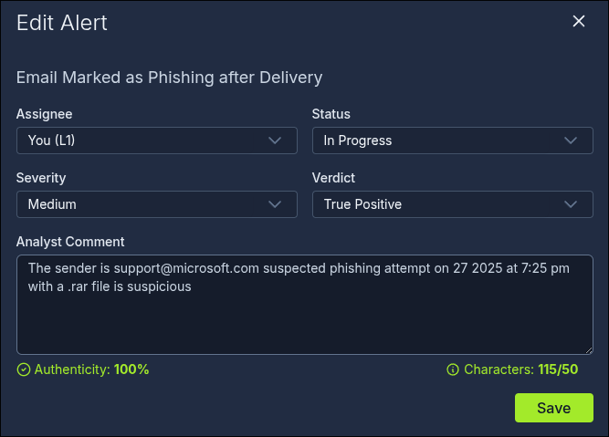
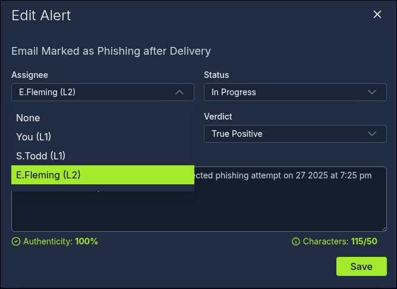
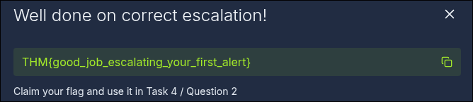
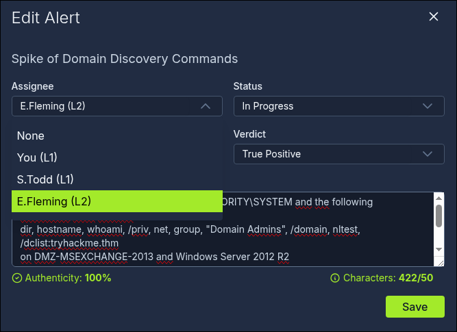

# TryHackMe — SOC L1 Alert Reporting: Write-Up

**Author:** [Calebe Araújo]
**Platform:** TryHackMe
**Room:** [SOC L1 Alert Reporting](https://tryhackme.com/room/socl1alertreporting)
**Category:** Blue Team / SOC Fundamentals
**Difficulty:** Easy

---

## Table of Contents

1. [Overview](#overview)
2. [Task 2 — Reporting, Escalation, and Communication](#task-2--reporting-escalation-and-communication)
3. [Task 3 — Writing a Good Alert Report (Five Ws)](#task-3--writing-a-good-alert-report-five-ws)
4. [Task 4 — Escalating Alerts to L2](#task-4--escalating-alerts-to-l2)
5. [Task 5 — Crisis Communication](#task-5--crisis-communication)
6. [Key Takeaways](#key-takeaways)

---

## Overview

This room follows directly from **SOC L1 Alert Triage** and covers what happens *after* an alert is classified: how to report it properly, when and how to escalate it to L2, and how to communicate about it internally (and in critical situations). It reuses the same simulated SOC dashboard, now focused on report quality and escalation decisions rather than raw verdicts.

Key concepts covered:

- The difference between **alert reporting**, **alert escalation**, and **communication**
- Why L1 analysts are asked to write reports instead of just tagging True/False Positive
- The **Five Ws** framework (Who, What, When, Where, Why) for structuring a report
- When an alert should be escalated to L2, and the mechanics of doing so on the dashboard
- How to handle communication in critical or ambiguous scenarios (crisis communication)

---

## Task 2 — Reporting, Escalation, and Communication

### Objective

Understand the path an alert takes after L1 triage, and learn the three new terms used to describe it.

### Concept

- **Alert reporting:** formally documenting the investigation and evidence behind a verdict, beyond a short comment — especially important for True Positives that need escalation.
- **Alert escalation:** passing a True Positive alert that needs deeper investigation or remediation on to an L2 analyst, following the team's agreed procedure.
- **Communication:** coordinating with other teams (IT, HR, legal, etc.) during or after analysis to validate or enrich the investigation.

Most alerts are closed by L1 as False Positives or handled at L1 level; only the complex/threatening ones flow further — L1 handles the initial volume, L2 remediates most confirmed breaches, and only a small fraction ever needs full DFIR.

### How i find it

Read through the funnel diagram (L1 → L2 → DFIR) and the room's explanation of each term to answer the two definition questions.

### Answer

**What is the process of passing suspicious alerts to an L2 analyst for review?**
```
alert escalation
```

**What is the process of formally describing alert details and findings?**
```
alert reporting
```

---

## Task 3 — Writing a Good Alert Report (Five Ws)

### Objective

Learn why L1 reporting matters and apply the Five Ws framework to write a report for a real phishing alert.

### Concept

Writing alert reports at L1 level serves three purposes:

| Purpose | Why it matters |
|---|---|
| Provide context for escalation | Saves L2 analysts time and helps them understand the situation quickly |
| Save findings for the record | Raw SIEM logs are often kept for only 3–12 months, but alerts (with their reports) are kept indefinitely |
| Improve investigation skills | Summarising an alert clearly is a strong sign you actually understood it |

A good report follows the **Five Ws**:

- **Who** — the user involved (login, command execution, download, etc.)
- **What** — the exact action or sequence of events
- **When** — start and end time of the suspicious activity
- **Where** — device, IP, or website involved
- **Why** — the reasoning behind the final verdict (arguably the most important W)

### How i find it

On the [SOC dashboard](https://static-labs.tryhackme.cloud/apps/socl1-alertreporting/), located the alert describing the sensitive-document leak to identify the user, then opened the new phishing alert, read its sender field, and — after assigning it to myself and moving it to In Progress — wrote a Five-Ws-based comment in the Analyst Comment field.






### Answer

**Which user email leaked the sensitive document?**
```
m.boslan@tryhackme.thm
```

**Who is the "sender" of the suspicious, likely phishing email?**
```
support@microsoft.com
```

**Flag received after writing a good Five-Ws report for the phishing alert:**
```
THM{nice_attempt_faking_microsoft_support}
```

---

## Task 4 — Escalating Alerts to L2

### Objective

Learn when an alert should be escalated to L2, and practice the escalation flow on the dashboard.

### Concept

Escalate an alert to L2 when:

1. It indicates a major cyberattack requiring deeper investigation or DFIR.
2. It requires remediation actions — malware removal, host isolation, password reset, etc.
3. It requires communication with customers, partners, management, or law enforcement.
4. You don't fully understand it and need help from a senior analyst.

Mechanically, escalation is usually just **reassigning the alert to the on-shift L2 analyst** (plus a ping in chat, or a formal escalation form in stricter teams). L2 then reads the L1 report, validates the verdict, communicates with other departments if needed, and — for major incidents — kicks off a formal Incident Response process.

**SOC Dashboard escalation flow:**
1. Move the alert to **In Progress** and investigate.
2. Write an alert report and set your **verdict** (e.g., True Positive).
3. If escalation is needed, assign the alert **to your L2** on shift.
4. L2 gets notified and starts from your report.

### How i find it

Checked the dashboard's assignee list to find the current L2 on shift, then escalated the phishing alert from Task 3 by setting an intermediate verdict and reassigning it. Repeated the same investigation → verdict → escalation flow for a second new alert (a reverse-shell alert on an Exchange server), documenting my findings before escalating.






### Answer

**Who is the current L2 you can escalate alerts to?**
```
E.Fleming
```

**Flag after correctly escalating the phishing alert:**
```
THM{good_job_escalating_your_first_alert}
```

**Analyst comment for the reverse-shell alert (second escalation):**

> A reverse shell attempt was made by `NT AUTHORITY\SYSTEM`, invoking the following commands: `dir`, `hostname`, `whoami /priv`, `net group "Domain Admins" /domain`, `nltest /dclist:tryhackme.thm`, on host **DMZ-MSEXCHANGE-2013** (Windows Server 2012 R2). The activity occurred on **March 27, 2025 at 7:56 PM**. The suspicious process chain was:
>
> - **Grandparent:** `C:\Windows\System32\inetsrv\w3wp.exe`
> - **Parent:** `C:\Users\Public\revshell.exe`
> - **Source:** `C:\Windows\System32\cmd.exe`
>
> This chain (IIS worker process → dropped `revshell.exe` in a public-writable folder → `cmd.exe` running domain-admin reconnaissance commands) strongly suggests a **web shell dropped through the legacy Exchange server**, followed by post-exploitation enumeration of the domain. Escalating for deeper analysis.

**Flag after escalating the reverse-shell alert:**
```
THM{looks_like_webshell_via_old_exchange}
```

---

## Task 5 — Crisis Communication

### Objective

Know how to react in edge cases that aren't covered by a normal triage/escalation flow.

### Concept

Recommended responses for common crisis scenarios:

- **L2 unreachable for 30+ minutes on a critical alert** → escalate the contact chain: L2 → L3 → manager (in that order).
- **Need to validate a Slack/Teams compromise with the affected user** → use an alternative channel (e.g., phone call), never the potentially-compromised chat itself.
- **Alert flood, some critical** → keep following the normal prioritisation workflow, but inform your on-shift L2 of the situation.
- **Realizing days later that an alert was misclassified** → contact L2 immediately; attackers can stay silent for weeks before causing impact.
- **SIEM logs not parsed/searchable** → don't skip the alert; investigate what you can and report the tooling issue to L2 or a SOC engineer.

### How i find it

Answered based on the room's guidance for each communication case.

### Answer

**Should you first try to contact your manager in case of a critical threat? (Yea/Nay)**
```
Nay
```

**Should you immediately contact your L2 if you think you missed an attack? (Yea/Nay)**
```
Yea
```

---

## Key Takeaways

| Concept | Where it applies | Lesson |
|---|---|---|
| Reporting vs. escalation vs. communication | Task 2 | Three distinct steps with distinct purposes — reporting documents, escalation hands off, communication coordinates |
| Five Ws framework | Task 3 | Who/What/When/Where/Why gives L2 everything needed without re-doing the analysis from scratch |
| Escalation criteria and mechanics | Task 4 | Escalate on scope, remediation need, external communication, or uncertainty — not just "high severity" |
| Process lineage (Grandparent → Parent → Source) | Task 4 | Tracing the full process chain (e.g., `w3wp.exe` → `revshell.exe` → `cmd.exe`) is what turns a vague alert into an accurate root-cause hypothesis |
| Crisis communication | Task 5 | Follow the escalation chain in order, use out-of-band contact for compromised channels, and never sit on a suspected miss |

> **Note:** the reverse-shell scenario in Task 4 is a good example of why analysts trace the full parent/grandparent process chain instead of stopping at the immediately suspicious process — it's what ties the activity back to the vulnerable Exchange server rather than just "a cmd.exe ran some recon commands."

---

*Write-up produced as part of an ongoing offensive/defensive security portfolio, with a focus on Blue Team / SOC fundamentals. All exercises were conducted within the TryHackMe learning platform's isolated lab environments.*