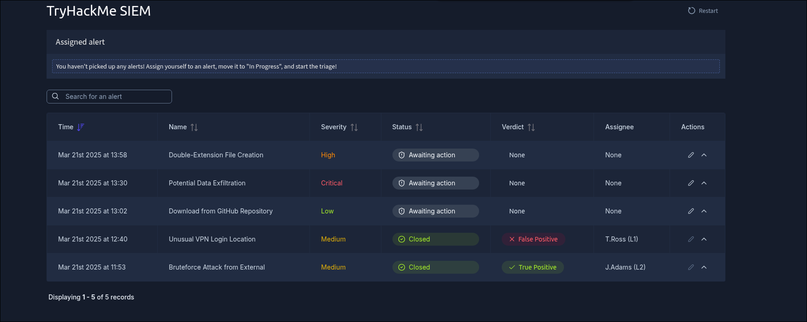
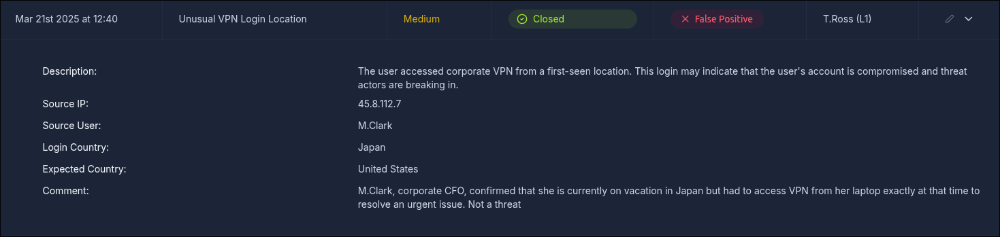
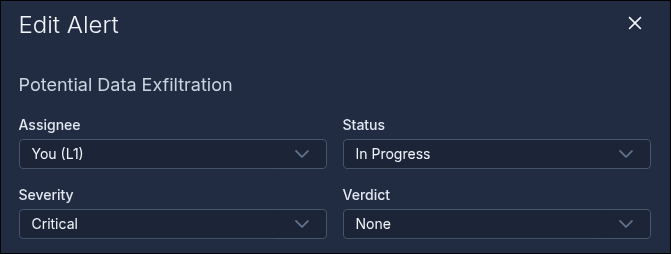
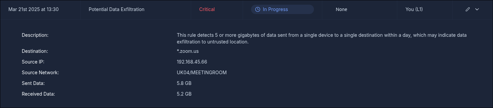
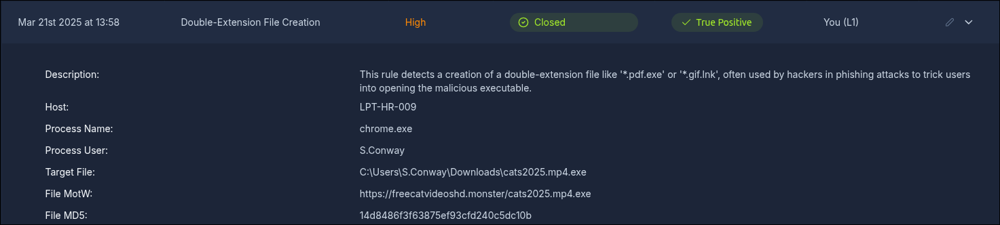
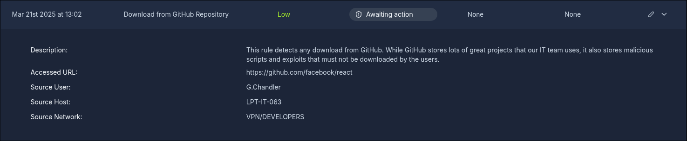

# TryHackMe — SOC L1 Alert Triage: Write-Up

**Author:** [Calebe Araújo]
**Platform:** TryHackMe
**Room:** [SOC L1 Alert Triage](https://tryhackme.com/room/socl1alerttriage)
**Category:** Blue Team / SOC Fundamentals
**Difficulty:** Easy

---

## Table of Contents

1. [Overview](#overview)
2. [Task 2 — From Events to Alerts](#task-2--from-events-to-alerts)
3. [Task 3 — Reading Alert Properties](#task-3--reading-alert-properties)
4. [Task 4 — Alert Prioritisation](#task-4--alert-prioritisation)
5. [Task 5 — Full Alert Triage Workflow](#task-5--full-alert-triage-workflow)
6. [Key Takeaways](#key-takeaways)

---

## Overview

This room is the entry point of the SOC Level 1 path. It introduces the alert lifecycle — from a raw event, to a logged event, to a correlated alert inside a SIEM/EDR/SOAR platform — and walks through the practical workflow an L1 analyst follows to triage alerts using a simulated SOC dashboard.

Key concepts covered:

- How alerts are generated from events (event → log → SIEM/EDR correlation → alert)
- The main **alert properties**: time, name, severity, status, verdict, assignee, description, and fields
- How to **prioritise** alerts (unassigned first, then by severity, then by age)
- The full **alert triage** workflow: initial actions → investigation → final actions (verdict, comment, close/escalate)

---

## Task 2 — From Events to Alerts

### Objetivo

Understand how raw events become alerts, and get familiar with the SOC dashboard used throughout the room.

### Conceitos

- An **event** is any recorded activity (login, process execution, file download, etc.).
- Events are logged by the originating system (OS, firewall, cloud provider) and shipped to a security solution (SIEM, EDR, NDR, SOAR).
- An **alert** is a notification generated when a specific event or sequence of events matches a detection rule — this is what lets analysts triage dozens of alerts a day instead of millions of raw logs.
- L1 analysts are the first line of defense; L2 analysts handle deeper investigation and remediation; SOC engineers tune the alerting pipeline; the SOC manager tracks triage speed and quality.

### Como encontrei

Opened the [SOC dashboard](https://static-labs.tryhackme.cloud/apps/socl1-alerttriage/) and reviewed the alert list to count total alerts and identify the most recent one by timestamp.



### Respostas

**How many alerts are on the SOC dashboard?**
```
5
```

**What is the name of the most recent alert?**
```
Double-Extension File Creation
```

---

## Task 3 — Reading Alert Properties

### Objetivo

Learn the main fields that make up an alert and use them to answer questions about a specific alert.

### Conceitos

Every alert generally exposes eight core properties:

| # | Property | Description |
|---|---|---|
| 1 | Alert Time | When the alert was created (usually a few minutes after the actual event) |
| 2 | Alert Name | Summary based on the detection rule's name |
| 3 | Alert Severity | Urgency set by detection engineers (Low/Medium/High/Critical) |
| 4 | Alert Status | New, In Progress, Closed, or custom statuses |
| 5 | Alert Verdict | True Positive / False Positive / other custom classification |
| 6 | Alert Assignee | Analyst who owns the alert |
| 7 | Alert Description | Rule logic, why it may indicate an attack, and triage guidance |
| 8 | Alert Fields | Analyst comments and the specific values that triggered the alert |

### Como encontrei

Opened the **"Unusual VPN Login Location"** alert on the dashboard and checked its Verdict and Alert Fields sections.



### Respostas

**What was the verdict for the "Unusual VPN Login Location" alert?**
```
False Positive
```

**What user was mentioned in the "Unusual VPN Login Location" alert?**
```
M.Clark
```

---

## Task 4 — Alert Prioritisation

### Objetivo

Learn how to decide which alert to pick up first when several are waiting in the queue.

### Conceitos

The generic prioritisation approach used by most SOC teams:

1. **Filter** — only take new, unseen, unresolved alerts (don't touch what a teammate is already handling).
2. **Sort by severity** — Critical → High → Medium → Low, since higher-severity rules are tuned to reflect bigger real-world impact.
3. **Sort by time** — oldest first, since an older breach likely has an attacker already progressing (e.g., exfiltrating data), while a newer one may still be in early discovery.

### Como encontrei

Reviewed the queue, filtered out alerts already assigned/reviewed, and sorted the remaining ones by severity and then by age to pick the first-priority alert. Assigned it to myself and moved it to **In Progress**.



### Respostas

**Should you prioritise medium over low severity alerts? (Yea/Nay)**
```
Yea
```

**Should you take the newest alerts first and the older ones later? (Yea/Nay)**
```
Nay
```

**Name of the first-priority alert you assigned to yourself:**
```
Potential Data Exfiltration
```

---

## Task 5 — Full Alert Triage Workflow

### Objetivo

Apply the complete triage workflow — initial actions, investigation, and final actions — to three alerts on the dashboard and reach a correct verdict for each.

### Conceitos

- **Initial actions:** assign the alert to yourself, move it to In Progress, review name/description/key fields.
- **Investigation:** identify who/what is affected, understand the action described, review surrounding events, and use threat intel or playbooks/workbooks when available.
- **Final actions:** set the verdict (True Positive / False Positive), write a comment explaining the reasoning, and move the alert to Closed (or escalate, covered in the next room).

### Como encontrei

Triaged the first-, second-, and third-priority alerts one by one, following the initial → investigation → final actions flow for each. Each correct verdict + comment combination released a flag on the dashboard.





### Respostas

**Flag after triaging the first-priority alert:**
```
THM{looks_like_lots_of_zoom_meetings}
```

**Flag after triaging the second-priority alert:**
```
THM{how_could_this_user_fall_for_it?}
```

**Flag after triaging the third-priority alert:**
```
THM{should_we_allow_github_for_devs?}
```

---

## Key Takeaways

| Concept | Where it applies | Lesson |
|---|---|---|
| Event → Log → Alert pipeline | Task 2 | Alerts exist to reduce millions of raw logs down to a handful of things worth a human's attention |
| Alert properties (time, severity, status, verdict, assignee, fields) | Task 3 | Reading these fields correctly is the first step of any triage, before touching raw logs |
| Prioritisation (unassigned → severity → age) | Task 4 | Severity first, then age — older breaches are more likely to already be progressing |
| Full triage workflow (initial → investigation → final actions) | Task 5 | A consistent, repeatable process is what prevents both missed threats and unnecessary escalations |

> **Note:** this room uses the TryHackMe SIEM (a simulated SOC dashboard), which mirrors real-world tools like Splunk ES, Elastic SIEM, or TheHive closely enough to build transferable muscle memory for actual L1 work.

---

*Write-up produced as part of an ongoing offensive/defensive security portfolio, with a focus on Blue Team / SOC fundamentals. All exercises were conducted within the TryHackMe learning platform's isolated lab environments.*