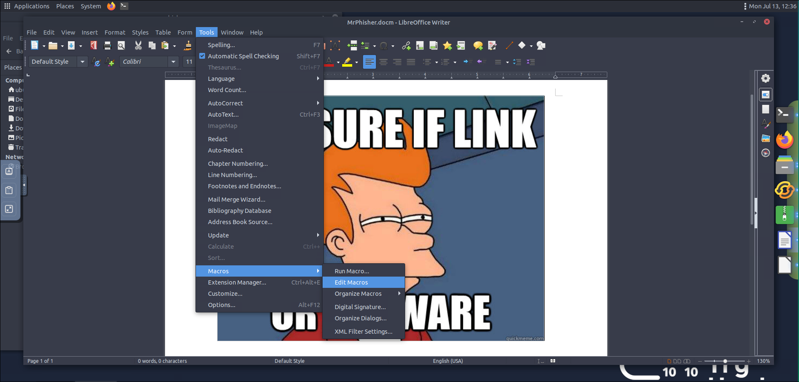
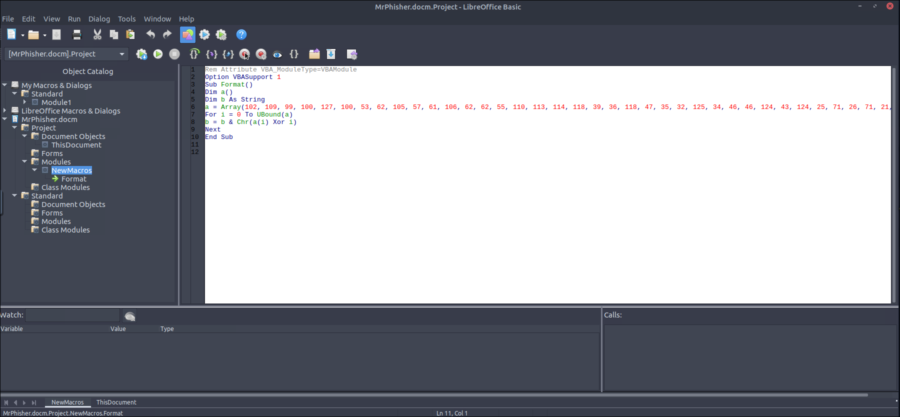
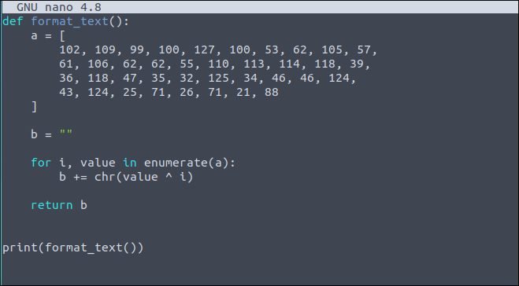
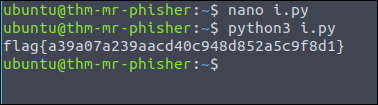

# TryHackMe — Mr. Phishing: Write-Up

**Author:** [Calebe Araújo]
**Platform:** TryHackMe
**Room:** Mr. Phishing
**Category:** Phishing Analysis / Macro Forensics
**Difficulty:** Easy

---

## Table of Contents

1. [Overview](#overview)
2. [Question 1 — Uncover the flag in the email attachment](#question-1--uncover-the-flag-in-the-email-attachment)
3. [Key Takeaways](#key-takeaways)

---

## Overview

This write-up documents the analysis of a Word document (`.docm`) received as an attachment in a simulated phishing email. The file contains an obfuscated VBA macro responsible for generating a flag at runtime.

The objective of the challenge is to extract this macro, understand the obfuscation logic employed, and reimplement it in another language to reveal the flag — without relying on the direct execution of the original code within the document.

---

## Question 1 — Uncover the flag in the email attachment

### Objective

Extract and decode the obfuscated payload present in the VBA macro of the malicious attachment.

### Concepts

- `.docm` documents can embed malicious VBA macros, used as the initial stage of an attack (dropper/downloader).
- It is common to obfuscate sensitive strings (URLs, payloads, flags) with simple and reversible operations, such as byte-by-byte XOR.
- Macro editors (Tools > Macros > Edit Macros, in LibreOffice/Word) allow inspecting this code statically, without executing it.

### How I Found It

1. I opened the `MrPhisher.docm` document in LibreOffice Writer.
2. I accessed **Tools > Macros > Edit Macros** to open the VBA editor (Basic IDE).

   

3. Inside the `NewMacros` module, I found a `Format()` subroutine containing a byte array (`a`) and a routine that reconstructs a string (`b`) by applying XOR between each byte of the array and its respective index:

   ```vb
   b = b & Chr(a(i) Xor i)
   ```

   

4. I rewrote this logic in Python, maintaining the same operation (XOR of the value by the index), to decode the array without needing to run the original macro:

   ```python
   def format_text():
       a = [
           102, 109, 99, 100, 127, 100, 53, 62, 105, 57,
           61, 106, 62, 62, 55, 110, 113, 114, 118, 39,
           36, 118, 47, 35, 32, 125, 34, 46, 46, 124,
           43, 124, 25, 71, 26, 71, 21, 88
       ]
       b = ""
       for i, value in enumerate(a):
           b += chr(value ^ i)
       return b

   print(format_text())
   ```

   

5. I saved the script as `i.py` and executed it in the terminal (`python3 i.py`), obtaining the flag.

   

### Answer

```
flag{a39a07a239aacd40c948d852a5c9f8d1}
```

---

## Key Takeaways

| Stage | Technique Used | Learning |
|---|---|---|
| Macro extraction | Tools > Macros > Edit Macros | Office documents can hide executable code within VBA macros |
| Obfuscation | Byte-by-byte XOR with the array index | Simple and reversible technique, common in low-sophistication payloads |
| Deobfuscation | Reimplementation of the logic in Python | Rewriting the logic of a malicious stage in another language allows validating the understanding without executing the original code |

> **Note:** analyzing macros directly in the editor, without executing them, is a safe practice of static analysis before any sandboxing.

---

*Write-up produced as part of an ongoing offensive/defensive security portfolio. All exercises were conducted within the TryHackMe learning platform's isolated lab environments.*