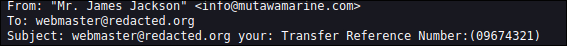
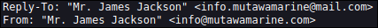
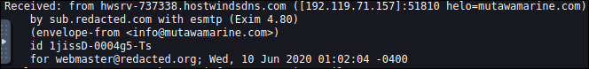
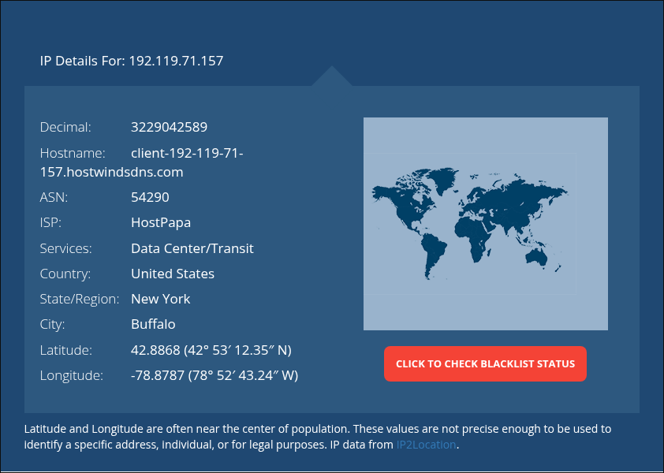
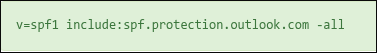
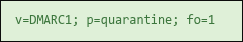
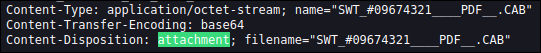
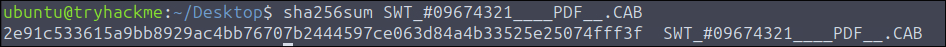
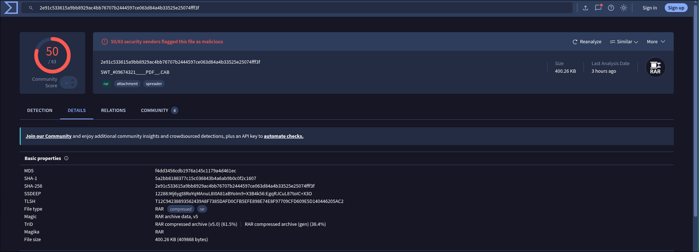

# TryHackMe — Phishing CTF: Write-Up

**Author:** [Calebe Araújo]
**Platform:** TryHackMe
**Room:** Snapped Phish-ing Line
**Category:** Phishing Analysis / Email Forensics
**Difficulty:** Easy

---

## Overview

This write-up covers the analysis of a phishing email and its attachment to extract indicators of compromise (IoCs) and answer the challenge questions. The investigation includes inspecting email headers (Subject, From, Reply-To, Received), performing IP and domain reputation/record lookups (ISP, SPF, DMARC), and analyzing the malicious attachment (obtaining its SHA-256 hash and investigating its properties via VirusTotal).

---

## Walkthrough & Answers

### 1. What is the subject header?

**Answer:** `09674321`

### 2. What is the display name of the sender?

**Answer:** `Mr. James Jackson`

### 3. What is the sender's email address?

**Answer:** `info@mutawamarine.com`

### 4. What is the reply-to email address?

**Answer:** `info.mutawamarine@mail.com`

### 5. What is the received IP address?

**Answer:** `192.119.71.157`

### 6. What is the name of the host/isp/domain lookup?

**Answer:** `HostPapa`

### 7. What is the SPF record for the domain?

**Answer:** `v=spf1 include:spf.protection.outlook.com -all`

### 8. What is the DMARC record for the domain?

**Answer:** `v=DMARC1; p=quarantine; fo=1`

### 9. What is the name of the attachment?

**Answer:** `SWT_#09674321____PDF__.CAB`

### 10. What is the SHA256 hash of the attachment?

**Answer:** `2e91c533615a9bb8929ac4bb76707b2444597ce063d84a4b33525e25074fff3f`

### 11. What is the file size of the attachment on VirusTotal?

**Answer:** `400.26 KB`

### 12. What is the file type of the attachment on VirusTotal?

**Answer:** `RAR`

---

*Write-up produced as part of an ongoing security portfolio. All exercises were conducted within the TryHackMe learning platform's isolated lab environments.*